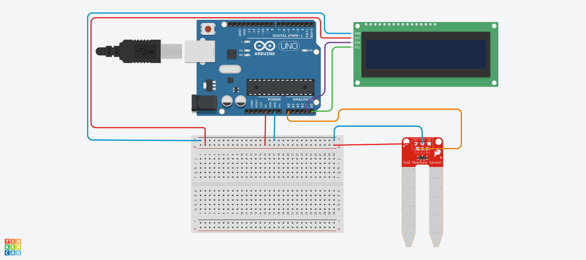

# Modèle de Capteur d'humidité de sol avec écran LCD

## Schéma de câblage
> 

> [📄 Voir le schéma complet en PDF](humidite-de-sol-avec-LCD.pdf)

## Description du projet

Ce projet Arduino permet de mesurer l’humidité du sol à l’aide d’un capteur analogique et d’afficher les résultats sur un écran LCD I2C. Il est idéal pour surveiller l’arrosage des plantes et sensibiliser à l’humidité du sol de façon ludique et interactive. L’interface propose des animations et des conseils dynamiques selon le niveau d’humidité détecté.

### Fonctionnalités principales
- Lecture de l’humidité du sol via un capteur analogique (A0)
- Affichage du pourcentage d’humidité sur un écran LCD I2C (adresse 0x27, 16x2)
- Barre de progression visuelle de l’humidité
- Conseils d’arrosage adaptés (trop sec, parfait, trop humide)
- Animations visuelles (goutte, smiley, pluie) selon l’état du sol
- Alternance automatique entre affichage graphique et conseils toutes les 3 secondes

## Matériel nécessaire
- Arduino UNO ou compatible
- Capteur d’humidité de sol analogique
- Écran LCD I2C (adresse 0x27 ou 0x3F, 16 colonnes x 2 lignes)
- Câbles de connexion
- (Optionnel) Résistances, breadboard

## Installation et utilisation
1. Connectez le capteur d’humidité à la broche analogique A0 de l’Arduino.
2. Branchez l’écran LCD I2C selon le schéma ci-dessus (SDA, SCL, VCC, GND).
3. Téléversez le code `Model_Capteur_dhumidite_de_sol_liee_avec_ecran_LCD.ino` sur votre carte Arduino.
4. Ouvrez le moniteur série à 9600 bauds pour observer les valeurs lues.
5. L’écran LCD affichera le pourcentage d’humidité, une barre de progression et des conseils d’arrosage.

## Structure du code
- `setup()`: Initialisation du LCD, animation de démarrage
- `loop()`: Lecture du capteur, conversion en pourcentage, alternance d’affichage
- `afficherInfos()`: Affichage des données et animations
- `animationGoutte()`, `animationSmiley()`, `animationPluie()`: Animations selon l’état du sol

## Conseils d’utilisation
- Adaptez les seuils d’humidité selon le type de plante ou de sol
- Vérifiez l’adresse I2C de votre écran LCD (0x27 ou 0x3F)
- Ajoutez une image du schéma de câblage dans la section dédiée

## Pour aller plus loin
- Ajoutez une alarme sonore ou une LED pour signaler un arrosage nécessaire
- Intégrez la mesure à une application mobile via Bluetooth ou WiFi
- Testez avec différents types de capteurs

---

# Auteur

- Abdelhakim Baalla

# Licence

Ce projet est sous licence MIT.
